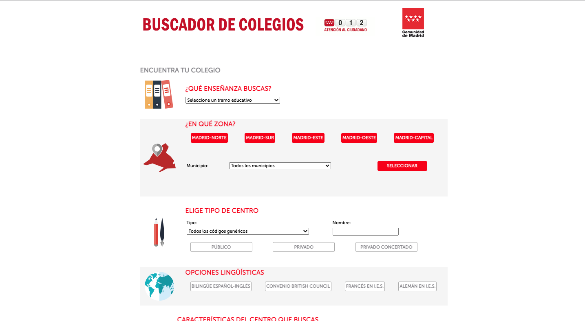
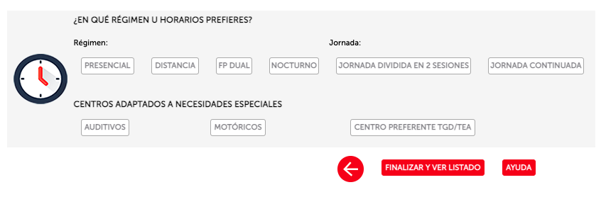

# BecasXCentroMadrid
Preparación de datos para analizar la distribución de becas por Centro en la Comunidad de Madrid

> **NOTA**: La Comunidad de Madrid ha cambiado el dominio que utiliza a finales de 2022. 
> Antes utilizaba la URL **gestiona3.madrid.org**, ahora 
> utiliza el dominio **gestiona.comunidad.madrid**. También se ha sustituido **http** por **htpps**

## Origen de los datos

### Datos de Centros
**Datos centros**: están sacados de la web. ¿Cómo se obtiene? En el buscador de Colegios de Comunidad de Madrid están todos los centros, se puede filtrar. Tan solo debemos seguir los siguientes pasos:

1. [Buscador de Colegios (Comunidad de Madrid) (A partir de 2023)](https://gestiona.comunidad.madrid/wpad_pub/run/j/MostrarConsultaGeneral.icm)
2. Se marca `¿Quieres incluir otros criterios?`
3. Marco las 5 zonas en `¿EN QUÉ ZONA?` 



5. Marco `FINALIZAR Y VER LISTADO`



6. El número de centros obtenidos es 4032, 23 centros menos que en Enero de 2019 (4057). En pantalla solo se muestran los 100 primeros. Obtenga el listado completo en `DESCARGAR LISTADO`.

7. Se descarga un fichero **.csv** codificado con `windows 1252`. Se ha convertido a `UTF-8` para su 
   posterior procesamiento en Phyton.

   También se elimina la primera línea del fichero, ya que no aporta información útil. Es esta:

```
CONSULTA DE CENTROS Y SERVICIOS EDUCATIVOS;;;;;;;;;;;;;;
```

   Así el fichero resultante tiene este aspecto:

```csv
AREA TERRITORIAL;CODIGO CENTRO;TIPO DE CENTRO;CENTRO;DOMICILIO;MUNICIPIO;DISTRITO MUNICIPAL;COD. POSTAL;TELEFONO;FAX;EMAIL;EMAIL2;TITULARIDAD
Madrid-Oeste;28060646;EEI;ACHALAY;Avenida De Isabel De Farnesio, 14 ;Boadilla del Monte;-;28660;916326518;-;eei.achalay.boadilla@educa.madrid.org;achalay-@hotmail.com;Público;
Madrid-Este;28063027;EEI;ACUARELA;Avenida Del Somorrostro, 193 ;San Fernando de Henares;-;28830;916694580;-;eei.acuarela.sanfernando@educa.madrid.org;-;Público;

...

```

> NOTA: Para la conversión de `windows 1252` a `UTF-8` se ha utilizado la web 
> [FreeFormatter.com](https://www.freeformatter.com/convert-file-encoding.html)

### Formato del fichero de centros

El fichero de centros es un `.csv` delimitado por `;` y codificado con `UTF-8`. 
Incluye una primera línea/fila que incluye los nombres de los diferentes campos:

   - AREA TERRITORIAL
   - CODIGO CENTRO
   - TIPO DE CENTRO
   - CENTRO
   - DOMICILIO
   - MUNICIPIO
   - DISTRITO MUNICIPAL
   - COD. POSTAL
   - TELEFONO
   - FAX
   - TITULARIDAD

#### Información adicional de un Centro

Para ver/extraer datos de un centro una vez conocido el código, basta con ponerlo así en la url:

   https://gestiona.comunidad.madrid/wpad_pub/run/j/MostrarFichaCentro.icm?cdCentro= **[ID_CENTRO]**
   
Por ejemplo, para consultar el centro *28041512 (IES CALATALIFA)*:

   [https://gestiona.comunidad.madrid/wpad_pub/run/j/MostrarFichaCentro.icm?cdCentro=28041512](https://gestiona.comunidad.madrid/wpad_pub/run/j/MostrarFichaCentro.icm?cdCentro=28041512)

Podemos extraer información adicional, como:

   * e-mail (no se incluye entre los datos exportados en el .csv) 
   * Datos estadíticos de alumnos matrículados en los últimos 5 años (no se carga por defecto, es una llamada AJAX) 
  
Adicionalmente se obtienen las coordenadas de latitud y longitud a partir de la dirección del centro: 
   * Latitud
   * Longitud

> NOTA: El fichero **grant.properties** incluye el API Key del  [Geocoding API
 de Google](https://developers.google.com/maps/documentation/geocoding/start). 
 Se utiliza para hacer el geocoding inverso y obtener las coordenadas 
 a partir de la dirección del centro. **Hay que añadir un API valida para que funcione correctamente**

### Cuantías de las becas

La información sobre las cuantías de las becas ha sido compartida por la Comunidad de Madrid mediante petición de transparencia realizada por @Fiquipedia (un heroe sin capa).

El fichero de cuantias de becas es un `csv` codificado en `UTF-8` con dos columnas:

   * **CÓDIGO DE CENTRO**
   * **CUANTÍA DE LAS BECAS** expresada en euros

Un fichero de este tipo tendría un aspecto dimilar a esto:

```csv
CÓDIGO DE CENTRO;CUANTÍA DE LAS BECAS
28000406;3000
28000406;3000
28000406;3000
28000406;3000

...

```

### Datos de Renta (No usado - Incluido en la lista de pendientes)

Los datos de la **Renta por persona** y **Renta por hogar** se han sacado de:
 
   - Datos de **2019**: [¿Escuela de ricos, escuela de pobres? Cómo la concertada y la pública segregan por clase social](https://elpais.com/economia/2019/09/11/actualidad/1568217626_928704.html)
   - Datos de **2021**: [El mapa de la renta de los españoles, calle a calle](https://elpais.com/economia/2021-04-29/el-mapa-de-la-renta-de-los-espanoles-calle-a-calle.html)
   - Datos: [Indicadores de renta media y mediana](https://www.ine.es/jaxiT3/Tabla.htm?t=31097)

## Cálculos

% becados (calculado entre dato nº becas / nº bach 17-18)

## Ejecución del programa

### Datos de los centros enriquecidos

El programa **MadridCenterDetailGroup.py** genera un fichero .csv con información
estadística de los alumnos matriculados en los últimos 5 años y las coordenadas de
latitud y longitud a partir del fichero de entrada (El .csv descargado desde el 
 **Buscador de Colegios (Comunidad de Madrid)**)

El programa acepta los siguientes parámetros:

 * **-i** Fichero .csv de entrada (El .csv descargado desde el 
 **Buscador de Colegios (Comunidad de Madrid)**)
 * **-o** Fichero .csv de salida con información estadística sobre los 
 alumnos matriculados y las coordenadas de latitud y longitud de cada centro
 
Ejemplo de invocación:

**Windows**
```console
python.exe MadridCenterDetailGroup.py -i resources\07-01-2023-(408)-utf8.csv -o resources\output\07-01-2023-(408)-utf8-extended-gps.csv
```

**Linux (ubuntu)**
```console
python3 MadridCenterDetailGroup.py -i "resources/07-01-2023-(408)-utf8.csv" -o "resources/output/07-01-2023-(408)-utf8-extended-gps.csv"
```

### Cruce de datos de centros con importe de becas

El programa **MadridCenterGrantDetail.py** mezcla un csv con los centros 
y las subvenciones por centro en un único fichero

El programa acepta los siguientes parámetros:

 * **-h** **--help**: Imprime la ayuda
 * **-c** **--center**: (Obligatorio) Fichero de Centros (csv con un listado de Centros (Colegios, Institutos...)
 * **-g** **--grant**: (Obligatorio) Archivo de subvenciones (csv con una lista de subvenciones por Centro)
 * **-o** **--output**: (Obligatorio) archivo de salida (archivo csv que contendrá información ampliada 
   para cada centro)
 
Ejemplo de invocación:

**Windows**
```console
python.exe MadridCenterGrantDetail.py -c <centers_file> -g <grant_file> -o output
```

**Linux (ubuntu)**
```console
python3 MadridCenterGrantDetail.py -c <centers_file> -g <grant_file> -o output
```

## Preparación de un servidor Ubuntu para ejecutar el programa

Si queremos ejecutar la aplicación en una instancia Linux (Ubuntu) de algún hiperscaler como AWS, Google o Azure, una vez creada la instancia y tras acceder por `ssh` deberemos ejecutar los siguientes comandos:

 - Actualizar el entorno

```console
apt-get update
apt-get install python3
apt-get install  git-all
apt-get install nano
```

 - Decargar el código de la aplicación:

```console
git clone https://github.com/joaquinOnSoft/BecasXCentroMadrid.git
```

 - Proporcionar el API KEY del API de geocodificación de Google:

```console
cd BecasXCentroMadrid/resources
nano grand.properties
```
 
En el editor hay que actualizar la propiedad `google.geocode.api.key`

```console
google.geocode.api.key=<GOOGLE_GEOCODE_APY_KEY>
```

 - Ejecutar las dos aplicaciones:

```console
cd ..

python3 MadridCenterDetailGroup.py \
    -i "resources/07-01-2023-(408)-utf8.csv" 
    -o "resources/output/07-01-2023-(408)-utf8-extended-gps.csv"

python3 MadridCenterGrantDetail.py \
    -c resources/output/07-01-2023-(408)-utf8-extended-gps.csv" \
    -g "resources/2023-01-13-BecasSegunaOportunidadCurso2021-202.csv" \
    -o output "resources/output/07-01-2023-(408)-utf8-extended-gps-con-becas.csv"
```